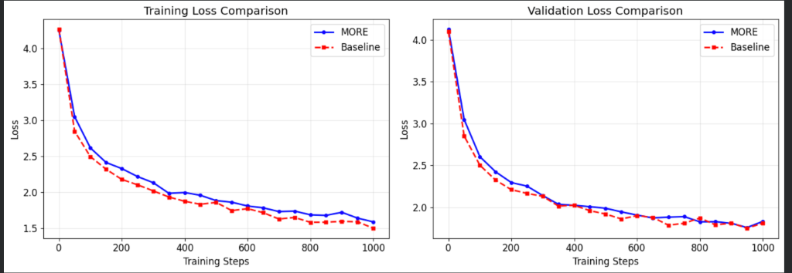
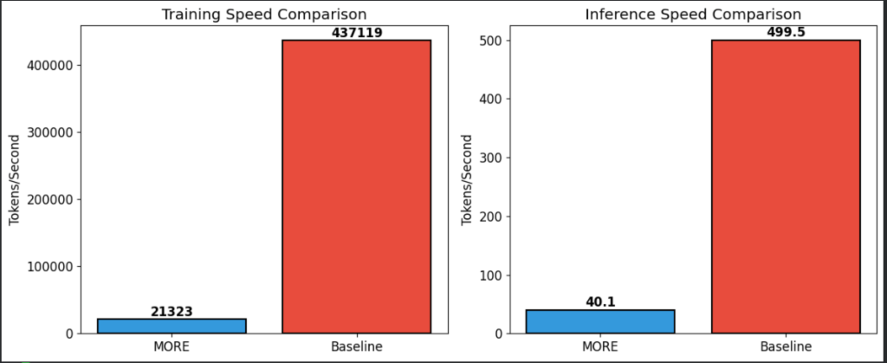
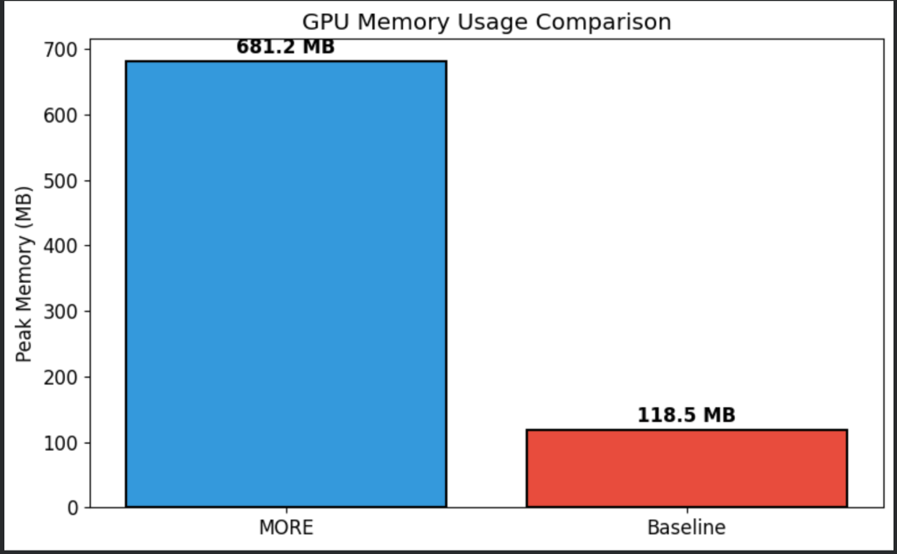
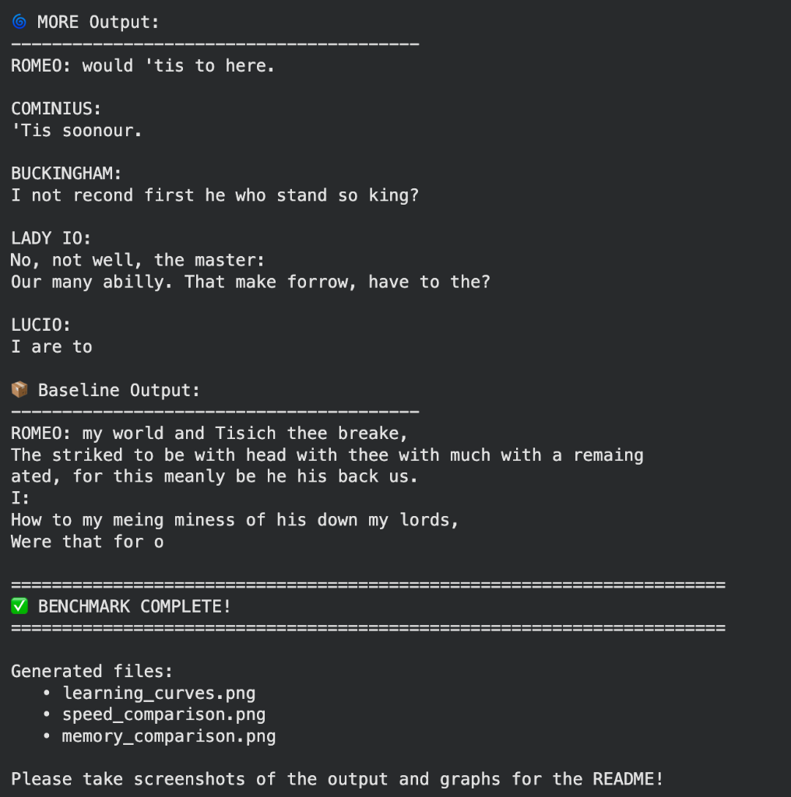

# MORE: Mixture of Recursive Experts

<div align="center">


*An experimental transformer architecture exploring recursive computation and dynamic expert routing.*

</div>

---

## 🔬 What is MORE?

**MORE (Mixture of Recursive Experts)** is an experimental language model architecture that departs from standard fixed-depth transformers. Instead of stacking identical layers, MORE uses a **Mixture of Experts (MoE)** routing mechanism to dynamically assign tokens to "Recursive Experts."

Each expert is a mini-transformer that **"thinks" for a variable number of steps**, creating a fractal-like computation graph where difficulty could theoretically determine depth.

> ⚠️ **Disclaimer**: This is a research exploration, not a production-ready model. At small scales, it does not outperform standard transformers. The architecture demonstrates novel patterns for future research at larger scales.

---

## 🧠 Key Innovations

| Innovation | Description |
|:-----------|:------------|
| **Recursive Experts** | Each expert loops through Attention + FFN `N` times, unlike standard single-pass FFNs |
| **Step Embeddings** | Learnable embeddings injected at each recursion to differentiate depth |
| **Sparse MoE Routing** | Top-k expert selection per token for computational efficiency |
| **Fractal Depth** | Effective network depth varies dynamically per token |

---

## 🏗️ Architecture

```
┌─────────────────────────────────────────────────────────────┐
│                      FRACTAL BLOCK                          │
├─────────────────────────────────────────────────────────────┤
│                                                             │
│   Input ──► Self-Attention ──► RMSNorm ──► MoRE Layer ──►  │
│                                                             │
│   ┌─────────────────── MoRE Layer ───────────────────┐     │
│   │                                                   │     │
│   │   Router ──┬──► Expert 1 (3 recursive loops) ──┐ │     │
│   │            │                                    │ │     │
│   │            └──► Expert 2 (3 recursive loops) ──┼─┼──►  │
│   │                        ...                      │ │     │
│   │            └──► Expert N (3 recursive loops) ──┘ │     │
│   │                                                   │     │
│   │   Weighted Sum of Top-K Expert Outputs           │     │
│   └───────────────────────────────────────────────────┘     │
│                                                             │
└─────────────────────────────────────────────────────────────┘
```

Each **Recursive Expert** internally loops:
```
for step in range(n_recursions):
    z = z + step_embedding[step]
    z = z + TinyAttention(z)
    z = z + SwiGLU_FFN(z)
```

---

## 📊 Benchmark Results

Trained on **Tiny Shakespeare** dataset for 1000 steps on a Tesla T4 GPU.

### Learning Curves



Both models converge to similar loss values, with the baseline being slightly better at this scale.

---

### Performance Comparison

| Metric | MORE | Baseline | Δ |
|:-------|-----:|--------:|:---:|
| **Parameters** | 1,457,920 | 336,640 | 4.3x larger |
| **Final Train Loss** | 1.5862 | 1.4983 | +5.9% worse |
| **Final Val Loss** | 1.8330 | 1.8123 | +1.1% worse |
| **Training Time** | 192.1s | 9.4s | 20x slower |
| **Training Speed** | 21,323 tok/s | 437,119 tok/s | 20x slower |
| **Inference Speed** | 40.1 tok/s | 499.5 tok/s | 12x slower |
| **Peak Memory** | 681.2 MB | 118.5 MB | 5.7x more |

---

### Speed Comparison



---

### Memory Usage



---

### Sample Generation



---

## 🤔 Honest Analysis

**At this scale, MORE does NOT outperform a standard transformer.**

### Why?

1. **MoE Overhead**: The routing mechanism adds significant compute without enough parameters to specialize.
2. **Recursion Cost**: Each expert runs 3 loops of attention+FFN, multiplying compute by 3x per expert.
3. **Scale Mismatch**: MoE architectures typically only show benefits at billion+ parameter scales (e.g., Mixtral, Switch Transformer).
4. **Task Mismatch**: Character-level prediction doesn't require "multi-step thinking" that recursive experts could provide.

### When might MORE shine?

- **Much larger scales** (10B+ parameters)
- **Reasoning tasks** (math, logic, code generation)
- **Variable-difficulty inputs** where some tokens genuinely need more "thought"
- **With proper load balancing** and auxiliary losses for expert utilization

---

## 🚀 Getting Started

### Prerequisites
- Python 3.8+
- PyTorch 2.0+
- CUDA (recommended)

### Installation

```bash
git clone https://github.com/AkhilVarma2709/mixture_of_recursive_experts.git
cd mixture_of_recursive_experts
pip install -r requirements.txt
```

### Quick Start

```bash
# Train the model
python more.py

# Run full benchmark suite
python benchmark_more.py
```

---

## 📁 Project Structure

```
MORE/
├── more.py               # Main model implementation
├── benchmark_more.py     # Benchmarking & visualization script
├── requirements.txt      # Dependencies
├── input.txt             # Shakespeare dataset
├── images/               # Benchmark visualizations
│   ├── learning_curves.png
│   ├── speed_comparison.png
│   ├── memory_comparison.png
│   └── sample_output.png
└── README.md
```

---

## 🔧 Configuration

```python
@dataclass
class Config:
    vocab_size: int = 65          # Vocabulary size
    n_embd: int = 128             # Embedding dimension
    n_head: int = 4               # Attention heads
    n_layer: int = 2              # Number of Fractal Blocks
    num_experts: int = 4          # Recursive experts per layer
    top_k: int = 2                # Experts activated per token
    n_recursions: int = 3         # Loops per expert
    intermediate_size: int = 256  # FFN hidden dimension
```

---

## 📜 License

MIT License - feel free to use, modify, and distribute.

---

## 🙏 Acknowledgments

- Architecture inspired by Mixture of Experts (MoE) research
- Dataset: [Tiny Shakespeare](https://raw.githubusercontent.com/karpathy/char-rnn/master/data/tinyshakespeare/input.txt) by Andrej Karpathy

---

<div align="center">

### 👨‍💻 About the Author

**Architecture designed by Akhil Varma**  
*Code implementation assisted by AI*

The core concept of Mixture of Recursive Experts—combining sparse routing with iterative "thinking" loops—was conceived and designed by Akhil Varma. The implementation was developed with AI assistance to translate the architectural vision into working PyTorch code.

---

*February 2026*

**This project demonstrates that not all innovations work at all scales—and that's okay. The journey of exploration is valuable.**

</div>
